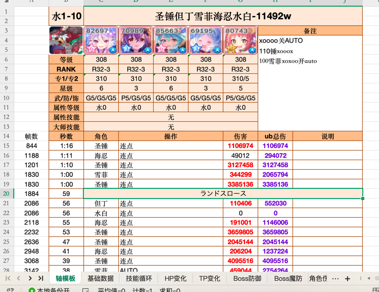
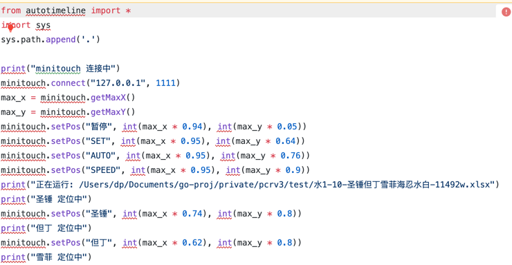

# pcr-gen
## 这是什么？
这是一个支持轴模板表格生成公会战打轴脚本的小工具\
本质上是用脚本生成脚本（
## 如何使用？
1. 准备一个PCR的轴模板文件[水1-10-圣锤但丁雪菲海忍水白-11492w.xlsx](test/%E6%B0%B41-10-%E5%9C%A3%E9%94%A4%E4%BD%86%E4%B8%81%E9%9B%AA%E8%8F%B2%E6%B5%B7%E5%BF%8D%E6%B0%B4%E7%99%BD-11492w.xlsx)
2. 确定公会战/当前版本所在的月份
3. 在release页面选择符合日期的脚本，保持最佳生成脚本的准确度，如果不确定版本则以当前日期为准
4. 运行对应平台的可执行文件
5. 选择想要生成脚本的轴模板表格
6. 将模板同路径下生成的同名脚本文件导入AutoTimeline工具实现模拟器自动打轴
## 效果如何？
### 输入表格

### 输出脚本

### 游戏效果不便展示
## 相关链接
[AutoTimeline](https://github.com/sdyxxjj123/AutoTimeline)

